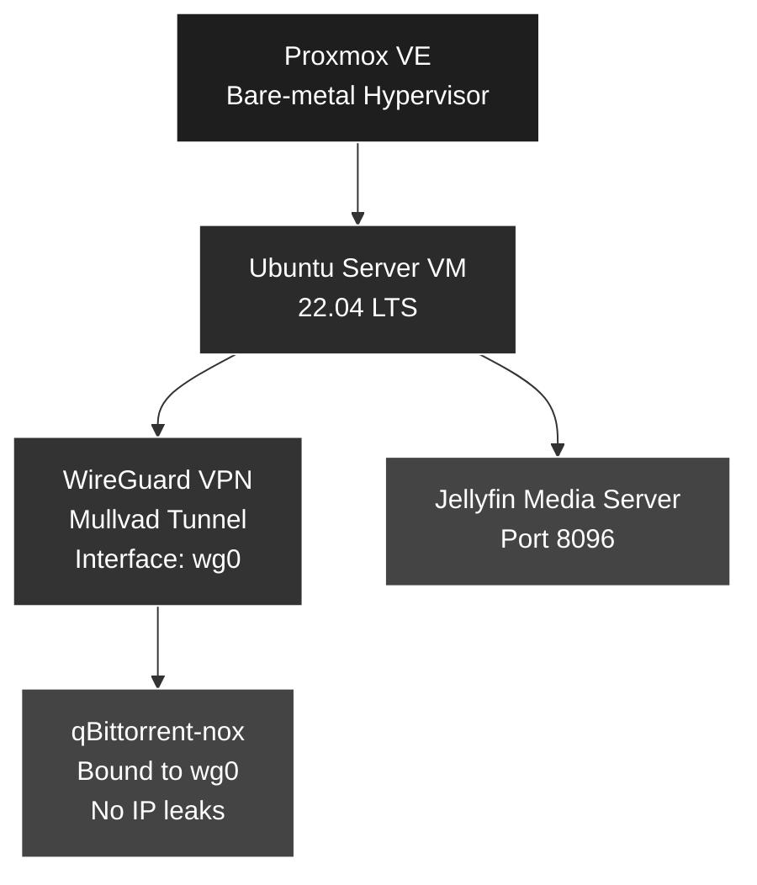

Proxmox HomeLab — Secure VPN-Routed Media Server (qBittorrent + Jellyfin)
Table of Contents

Overview
Architecture
Proxmox Setup
WireGuard VPN
qBittorrent (VPN-Bound)
Jellyfin Media Server
Media Directory Structure
Troubleshooting & Lessons

Overview

This project implements a secure, self-hosted media server stack inside a Proxmox VE hypervisor using:
Ubuntu Server 22.04
WireGuard VPN (Mullvad)
qBittorrent (locked to VPN interface)
Jellyfin media server
A scalable /mnt/media filesystem layout

The goal was to build real-world skills in virtualization, networking, Linux administration, encryption, routing, and service troubleshooting.

## Architecture (Mermaid Diagram)

All torrent traffic is routed exclusively through wg0.

Section 1 — Proxmox Setup
Host Setup

Installed Proxmox VE on spare hardware

Configured vmbr0 for bridged networking

Created an Ubuntu Server 22.04 VM

Installed Ubuntu via ISO

Networking Issue

The VM lost internet (100% packet loss).
Debugging steps:
ip route
ping 1.1.1.1

Cause: a pfSense VM interfered with gateway routing.

Fix:

Halted pfSense
Rebooted Ubuntu VM
Internet restored

Section 2 — WireGuard VPN Integration (Mullvad)
Installation
sudo apt install wireguard

Config
sudo nano /etc/wireguard/wg0.conf

Security
sudo chmod 600 /etc/wireguard/wg0.conf

Start Tunnel 
sudo wg-quick up wg0

Verify
curl ifconfig.me
# Returned Mullvad exit IP: 146.70.171.183

Auto Start
sudo systemctl enable wg-quick@wg0

Section 3 — qBittorrent-nox (VPN-Bound)

Install
sudo apt install qbittorrent-nox
Enabled
sudo systemctl enable qbittorrent-nox

Web UI Recovery

Credentials were forgotten — reset using:

~/.config/qBittorrent/qBittorrent.conf

Cleared WebUI entries → qBit returned to:

username: admin

password: adminadmin

Bind to VPN Interface

In Web UI:

Tools → Options → Advanced → Network Interface → wg0

This forces all torrent traffic through the VPN.

If VPN goes down → qBit instantly loses internet (safety measure).

Section 4 — Jellyfin Media Server
Installation

Installed from official .deb:

Section 5 — Media Directory Structure
Directories
sudo mkdir -p /mnt/media/movies
sudo mkdir -p /mnt/media/tv
sudo mkdir -p /mnt/media/anime
sudo mkdir -p /mnt/media/music
sudo mkdir -p /mnt/media/downloads
sudo chown -R robin:robin /mnt/media

Section 6 — Troubleshooting & Lessons Learned

Networking Issues 
Default gateway missing
pfSense interference
Resolved via routing and DNS checks
Commands used extensively:
ip a
ip route
ping
curl

VPN Leak Prevention
qBittorrent explicitly bound to wg0
Traffic isolation verified with packet tests

Linux Administration 
Systemctl management 
Editing config files 
Permissions and ownership
Directory structure planning

Virtualization Skills
VM deployment 
Network bridging
Storage allocation
Understanding NIC behavior inside VMs

What This Project Demonstrates

This project showcases:
Virtualization (Proxmox)
Linux system administration
VPN tunneling
Routing & network isolation
Service configuration
Troubleshooting real-world failures
Web-based application hosting
Secure torrenting best practices
Media server deployment (Jellyfin)

Future Expansions
Sonarr / Radarr automation
Prowlarr indexer integration
Docker + Portainer migration
Cloudflare Tunnel for secure external access
SMB/NFS shares
GPU transcoding (Intel/NVIDIA)
Intune + Azure AD enterprise lab
